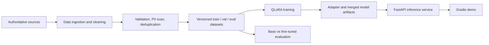

# IND_CHAT

A portfolio-scoped assistant for Indian-context domain questions, built around QLoRA fine-tuning of a small open-weight language model.

> **Status:** Project scaffold / Phase 0. The repository structure and reproducible configuration are being established before data collection and GPU training.
>
> **Safety:** Outputs are for demonstration and research only. They are not legal, tax, financial, or professional advice.

## Project goals

- Build a versioned instruction dataset from authoritative Indian sources.
- Fine-tune an open-weight instruct model with 4-bit QLoRA on a single GPU.
- Compare base and fine-tuned models on a held-out evaluation set.
- Serve the model through FastAPI with a small demo UI.
- Keep every stage configurable, testable, and reproducible.

The first target domain is **Indian GST / tax queries**. That choice is recorded as an assumption and can be changed before data collection begins.

## Architecture



## Repository layout

- `config/` — YAML configuration for data, training, evaluation, and inference.
- `src/llm_finetune/` — importable data, training, evaluation, inference, API, and utility modules.
- `scripts/` — thin command-line entry points.
- `data/` — raw, interim, processed, and evaluation-output directories; large/generated artifacts are ignored.
- `models/` and `logs/` — local artifacts and logs; ignored by Git.
- `docs/` — assumptions, architecture, limitations, and evaluation reporting.
- `deployment/` — container and AWS deployment assets.

## Setup

```bash
git clone https://github.com/sameerkumar01/IND_CHAT.git
cd IND_CHAT
python -m venv .venv
source .venv/bin/activate
pip install -e '.[dev]'
cp .env.example .env
```

Training requires a CUDA-capable GPU and the CUDA-compatible PyTorch build. Data preparation and unit tests should remain runnable on CPU.

## Workflow

```bash
# Run tests
make test

# Prepare and validate the dataset
make data

# Train with the configured QLoRA recipe (GPU required)
make train

# Evaluate base vs fine-tuned checkpoints
make eval

# Start the API locally
make serve
```

The commands are intentionally thin wrappers. Configuration belongs under `config/`; implementation belongs under `src/`.

## API example

```bash
curl -X POST http://localhost:8000/generate \
  -H 'Content-Type: application/json' \
  -H "X-API-Key: ${API_KEY:-}" \
  -d '{"prompt":"What is GST registration threshold in India?"}'
```

Expected response shape:

```json
{"text":"Model output will appear here.","model":"configured-model","usage":null}
```

## Results

Evaluation numbers will be added after the first reproducible training and evaluation run. The report will compare the base and fine-tuned models on the same held-out examples using automatic metrics, rubric-based judging, and a manual review sample.

## Development principles

- No secrets or model artifacts are committed.
- Public functions and classes use type hints and Google-style docstrings.
- Errors are logged with actionable context rather than silently swallowed.
- Dataset splits are validated for duplicates and leakage.
- Assumptions and known limitations are documented rather than hidden.

## License

Apache License 2.0. See [`LICENSE`](LICENSE).

## Learning and source resources

See [`docs/resources.md`](docs/resources.md) for official GST references, the Qwen model card, Hugging Face QLoRA documentation, and Kaggle notebook links.

For the Kaggle-specific workflow, see [`docs/kaggle_setup.md`](docs/kaggle_setup.md).
